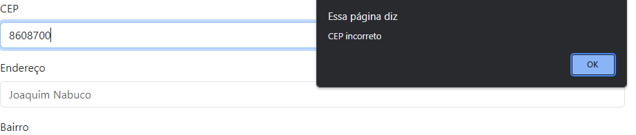
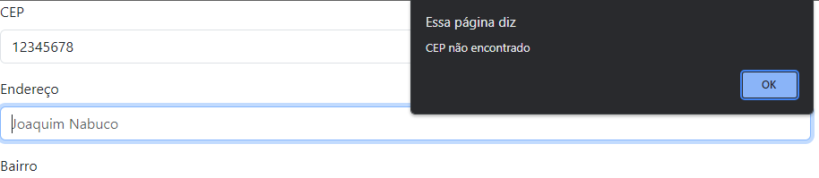

### [English Version]()

<h1 align="center">Cadastro de Endereço</h1>
<p align="center">Um site que puxa o endereço pelo cep inserido usando <code>json</code> e <code>strictmode</code></p>

# Introdução


Assim que voce insere o Cep e clica em tab o site deverá retornar preenchendo automaticamente as informações de endereço.

___

<h3>Em que casos o site não retorna as informações esperadas?</h3>

* Caso o usuário clique em cadastrar ou na tecla enter a vizualização das informações previamente não será possivel.
* Caso o cep esteja errado, incompleto ou eceder o numero de caracteres o site emitira um aviso e o site não retornará as informações.
  
<h3>Exemplos:</h3>
<p>Caso o usuário digite um cep de 8 digitos inválido:</p>



<p>Caso o usuário digite um cep incompleto ou com carcteres extras:</p>



# Códigos

```js
"use strict"; //Strict mode
// https://viacep.com.br/

//Função para limpar formulário
//Arrow function
const limparFormulario = () => {
    document.getElementById('rua').value = '';
    document.getElementById('bairro').value = '';
    document.getElementById('cidade').value = '';
    document.getElementById('estado').value = '';
}
```

